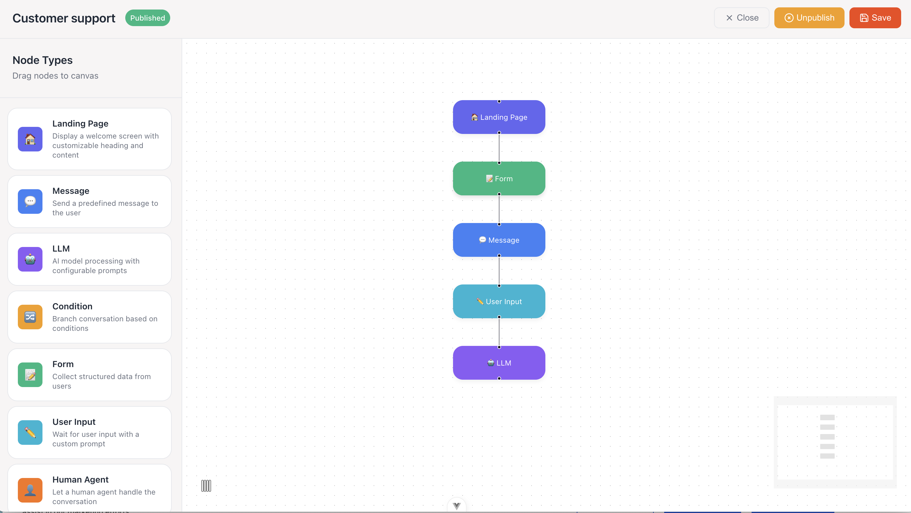

# ChatterMate - Open Source AI Customer Support Chatbot Platform

[](https://www.gnu.org/licenses/agpl-3.0)
[](https://www.npmjs.com/package/chattermate-cli)
[](https://hub.docker.com/r/chattermate/backend)


> **No-code AI chatbot framework for 24/7 customer support automation.** Self-hosted, multi-model AI support, intelligent human handoff, file attachments, Jira integration, and seamless website embedding. Build AI-powered help desk and live chat solutions without writing code.

**[Documentation](https://docs.chattermate.chat)** | **[Live Demo](https://chattermate.chat)** | **[Free Signup](https://chattermate.chat)**

---

## Table of Contents

- [Why ChatterMate?](#why-chattermate)
- [Features](#features)
- [Demo](#demo)
- [Quick Start](#quick-start-with-cli)
- [Installation](#installation-methods)
- [Deployment](#deployment)
- [Roadmap](#roadmap)
- [Contributing](#contributing)
- [Support](#support)

---

## Why ChatterMate?

ChatterMate is a **no-code AI chatbot agent framework** that enables businesses to provide **24/7 customer support** through intelligent AI agents. Your chatbot can handle common queries, escalate complex issues to human agents when needed, and continuously learn from your knowledge base articles. Integrate the chat widget easily on any website with a single line of code.

**Perfect for:** SaaS companies, e-commerce stores, help desks, customer success teams, and any business looking to automate customer support while maintaining a human touch.

---

## Features

### NEW Core Features

| Feature | Description |
|---------|-------------|
| 🆕 **Ask Anything Mode** | Let visitors start conversations instantly - no signup or email required. Perfect for Q&A, documentation assistants, and exploratory chat experiences. |
| 🆕 **Multi-Model AI Support** | Choose your AI provider - **OpenAI GPT-4**, **Groq Llama 3.3**, **Google AI**, **Ollama** (self-hosted), and more. Switch providers anytime without code changes. |
| 🆕 **Smart Human Handoff** | Intelligent transfer to human agents with **business hours awareness**, real-time availability detection, and context-aware escalation messages. |
| 🆕 **File Attachments** | Enable customers to share **images, PDFs, Word docs, spreadsheets**, and more directly in chat. Secure uploads with S3 storage and magic byte validation. |
| 🆕 **Auto Translation** | Multilingual support with configurable **default language per workflow**. Serve customers globally in their preferred language. |
| 🆕 **Jira Ticket Creation** | Create and manage **Jira tickets directly from chat** conversations. OAuth 2.0 secure integration with automatic ticket tracking. |
| 🆕 **Widget Authentication** | **Token-based security** for embedded widgets. Support both public Q&A and private authenticated conversations. |
| 🆕 **Slack Integration** | Connect your **Slack workspace** for internal product support. Enable teams to get AI-powered assistance directly in Slack channels. |
| 🆕 **Visual Workflow Builder** | Design complex conversation flows with a **drag-and-drop interface**. Create branching logic, conditional responses, and multi-step workflows without coding. |

### Workflow Builder

Build sophisticated conversation flows visually with our intuitive workflow builder:

<!-- TODO: Add workflow builder screenshot -->


**Workflow Builder Features:**
- **Drag-and-drop nodes** - AI responses, human handoff, conditions, and more
- **Branching logic** - Create different paths based on user input
- **Node types** - Start, AI Response, Human Transfer, Condition, End nodes
- **Real-time preview** - Test workflows before deploying
- **Version control** - Save and restore workflow versions

### Platform Features

| Feature | Description |
|---------|-------------|
| 🤖 **AI-Powered Responses** | Context-aware AI with conversation memory across sessions |
| 📊 **Analytics Dashboard** | Real-time monitoring, conversation insights, and performance metrics |
| 📚 **Knowledge Base Training** | Train your AI with domain-specific knowledge and FAQs |
| 🎨 **Custom Theming** | Fully customizable chat widget to match your brand |
| 🔐 **Role-Based Access Control** | Granular permissions for team members |
| 🌐 **Open Source & Self-Hosted** | Full control over your data with self-hosting option |

---

## Demo

### Video Walkthrough
[](https://youtu.be/bk40VSS2BLU)
[](https://www.youtube.com/embed/WyMQ8Poqn5E?mute=1&loop=1&playlist=WyMQ8Poqn5E&rel=0&controls=1)

### Agent Dashboard


### Analytics Dashboard


---

## Quick Start with CLI

Get ChatterMate running in minutes:

```bash
# Install the ChatterMate CLI globally
npm install -g chattermate-cli

# Create a new ChatterMate project
chattermate init my-chattermate-project

# Navigate to your project
cd my-chattermate-project

# Start all services with Docker
chattermate start

# Open http://localhost/ in your browser
```

### CLI Commands

```bash
chattermate init <project-name>    # Initialize a new project
chattermate start                  # Start all services
chattermate stop                   # Stop all services
chattermate status                 # Check service status
chattermate logs                   # View service logs
chattermate reset                  # Reset and cleanup project
```

---

## Installation Methods

### Prerequisites

**For CLI Installation (Recommended)**
- Node.js 16+
- Docker & Docker Compose
- npm or yarn

**For Manual Installation**
- Python 3.12+
- PostgreSQL 14+ (with Vector extension)
- Firebase Project (for push notifications)
- Redis (optional, for rate limiting and multi-server socket deployment)

### Method 1: CLI Installation (Recommended)

```bash
npm install -g chattermate-cli
chattermate init my-project
cd my-project
chattermate start
```

### Method 2: Docker Installation

```bash
# Build and start all services
docker compose up --build

# Run in background
docker compose up -d

# Stop services
docker compose down

# View logs
docker compose logs -f
```

### Method 3: Manual Installation

<details>
<summary>Click to expand manual installation steps</summary>

#### Backend Setup
```bash
cd backend
python -m venv venv
source venv/bin/activate  # Windows: venv\Scripts\activate
pip install -r requirements.txt

# Set up environment variables
cp .env.example .env
# Configure .env with your credentials

# Database setup
alembic upgrade head

# To generate revisions if any model changes
alembic revision --autogenerate -m "Changes description"
```

#### Frontend Setup
```bash
cd frontend
npm install
cp .env.example .env
```

For Web Push notification, generate a firebase config and place it in `backend/app/config/firebase-config.json`

</details>

---

## Running the Application

**Backend**
```bash
# Development
uvicorn app.main:app --reload --port 8000

# Run Knowledge Processor (in a separate terminal)
python -m app.workers.run_knowledge_processor
```

**Frontend**
```bash
# Development
npm run dev

# Build Widget for chat integration
npm run build:widget

# Build Web Client
npm run build:webclient
```

---

## Testing

**Backend**
```bash
pytest tests/
```

**Frontend**
```bash
npm run test:unit    # Unit tests
npm run test:e2e     # E2E tests
```

---

## Deployment

### Docker Deployment (Recommended)

Pre-built Docker images are available:

```bash
# Pull images
docker pull chattermate/frontend:latest
docker pull chattermate/backend:latest

# Run with production compose
docker compose -f docker-compose.prod.yml up -d
```

<details>
<summary>Click for production deployment without Docker</summary>

**Backend**
```bash
pip install gunicorn

gunicorn app.main:app \
    --workers 4 \
    --worker-class uvicorn.workers.UvicornWorker \
    --bind 0.0.0.0:8000 \
    --access-logfile - \
    --error-logfile - \
    --log-level info \
    --timeout 120
```

**Knowledge Processor (systemd)**
```bash
sudo tee /etc/systemd/system/chattermate-knowledge-processor.service << EOF
[Unit]
Description=ChatterMate Knowledge Processor
After=network.target

[Service]
User=chattermate
Group=chattermate
WorkingDirectory=/path/to/chattermate/backend
Environment="PATH=/path/to/chattermate/backend/venv/bin"
ExecStart=/path/to/chattermate/backend/venv/bin/python -m app.workers.run_knowledge_processor
Restart=always

[Install]
WantedBy=multi-user.target
EOF

sudo systemctl daemon-reload
sudo systemctl enable chattermate-knowledge-processor
sudo systemctl start chattermate-knowledge-processor
```

**Frontend**
```bash
npm run build
# Serve using nginx or other web server
```

</details>

---

## Roadmap

### Coming Soon

- 🔄 **Auto Follow-up System** - Automated follow-ups for idle customers
- 📘 **Customer Contact Management** - CRM-like contact organization
- 🤝 **Human Agent AI Suggestions** - AI-powered response suggestions for agents
- 📞 **AI Voice Chat** - Voice-enabled AI conversations
- 🔌 **More Integrations** - Zendesk, Intercom, and more

---

## Contributing

We welcome contributions! Here's how to get started:

1. Fork the repository
2. Create a feature branch (`git checkout -b feature/amazing-feature`)
3. Commit your changes (`git commit -m 'Add amazing feature'`)
4. Push to the branch (`git push origin feature/amazing-feature`)
5. Open a Pull Request

### Development Guidelines
- Follow PEP 8 style guide
- Write tests for new features
- Update documentation as needed
- Add type hints to new functions

---

## Support

- 📖 **Documentation**: [docs.chattermate.chat](https://docs.chattermate.chat)
- 🐛 **Issues**: [GitHub Issues](https://github.com/chattermate/chattermate/issues)
- 📧 **Email**: support@chattermate.chat

---

## License

ChatterMate is open source software available under a **dual license**:

**Open Source (AGPL-3.0)**
- Free for personal and commercial use
- Source code must be disclosed for modified versions
- Network users must have access to source code if deployed as a service
- Derivative works must be licensed under AGPL-3.0

**Commercial License**
- Available for proprietary integrations
- No source disclosure requirements
- Official support and warranties
- Contact: [contact@chattermate.chat](mailto:contact@chattermate.chat)

See [LICENSE](license.md) for full details.

---

<p align="center">
  Made with ❤️ by the ChatterMate team
</p>

<p align="center">
  <b>Keywords:</b> AI chatbot, customer support automation, open source help desk, live chat software, self-hosted chatbot, no-code chatbot builder, GPT-4 customer service, human handoff, Jira integration, Slack bot, multilingual chatbot
</p>
