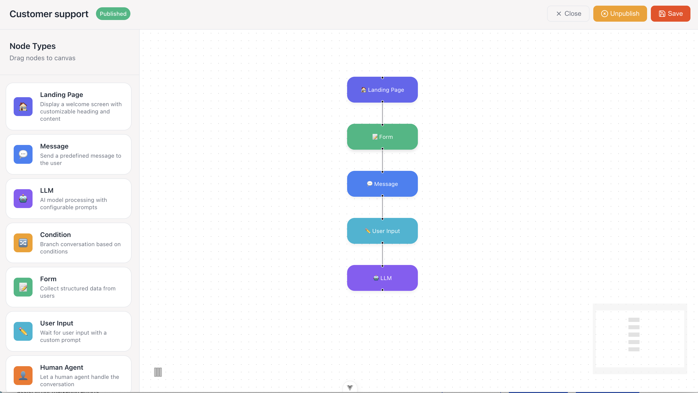

# ChatterMate - Open Source AI Customer Support Chatbot Platform

[](https://opensource.org/licenses/Apache-2.0)
[](https://www.npmjs.com/package/chattermate-deploy)
[](https://hub.docker.com/r/chattermate/backend)


> **No-code AI chatbot framework for 24/7 customer support automation.** Self-hosted, multi-model AI support, intelligent human handoff, file attachments, Jira integration, and seamless website embedding. Build AI-powered help desk and live chat solutions without writing code.

**[Documentation](https://docs.chattermate.chat)** | **[Live Demo](https://chattermate.chat)** | **[Free Signup](https://app.chattermate.chat)**

---

## Table of Contents

- [Why ChatterMate?](#why-chattermate)
- [Features](#features)
- [Demo](#demo)
- [Quick Start](#quick-start)
- [Installation](#installation-methods)
- [Deployment](#deployment)
- [Roadmap](#roadmap)
- [Contributing](#contributing)
- [Support](#support)

---

## Why ChatterMate?

ChatterMate is a **no-code AI chatbot agent framework** that enables businesses to provide **24/7 customer support** through intelligent AI agents. Your chatbot can handle common queries, escalate complex issues to human agents when needed, and continuously learn from your knowledge base articles. Integrate the chat widget easily on any website with a single line of code.

**Perfect for:** SaaS companies, e-commerce stores, help desks, customer success teams, and any business looking to automate customer support while maintaining a human touch.

---

## Features

### NEW Core Features

| Feature | Description |
|---------|-------------|
| 🆕 **Ask Anything Mode** | Let visitors start conversations instantly - no signup or email required. Perfect for Q&A, documentation assistants, and exploratory chat experiences. |
| 🆕 **Multi-Model AI Support** | Choose your AI provider - **OpenAI GPT-4**, **Groq Llama 3.3**, **Google AI**, **Ollama** (self-hosted), and more. Switch providers anytime without code changes. |
| 🆕 **Smart Human Handoff** | Intelligent transfer to human agents with **business hours awareness**, real-time availability detection, and context-aware escalation messages. |
| 🆕 **File Attachments** | Enable customers to share **images, PDFs, Word docs, spreadsheets**, and more directly in chat. Secure uploads with S3 storage and magic byte validation. |
| 🆕 **Auto Translation** | Multilingual support with configurable **default language per workflow**. Serve customers globally in their preferred language. |
| 🆕 **Jira Ticket Creation** | Create and manage **Jira tickets directly from chat** conversations. OAuth 2.0 secure integration with automatic ticket tracking. |
| 🆕 **Widget Authentication** | **Token-based security** for embedded widgets. Support both public Q&A and private authenticated conversations. |
| 🆕 **Slack Integration** | Connect your **Slack workspace** for internal product support. Enable teams to get AI-powered assistance directly in Slack channels. |
| 🆕 **Visual Workflow Builder** | Design complex conversation flows with a **drag-and-drop interface**. Create branching logic, conditional responses, and multi-step workflows without coding. |

### Workflow Builder

Build sophisticated conversation flows visually with our intuitive workflow builder:

<!-- TODO: Add workflow builder screenshot -->


**Workflow Builder Features:**
- **Drag-and-drop nodes** - AI responses, human handoff, conditions, and more
- **Branching logic** - Create different paths based on user input
- **Node types** - Start, AI Response, Human Transfer, Condition, End nodes
- **Real-time preview** - Test workflows before deploying
- **Version control** - Save and restore workflow versions

### Platform Features

| Feature | Description |
|---------|-------------|
| 🤖 **AI-Powered Responses** | Context-aware AI with conversation memory across sessions |
| 📊 **Analytics Dashboard** | Real-time monitoring, conversation insights, and performance metrics |
| 📚 **Knowledge Base Training** | Train your AI with domain-specific knowledge and FAQs |
| 🎨 **Custom Theming** | Fully customizable chat widget to match your brand |
| 🔐 **Role-Based Access Control** | Granular permissions for team members |
| 🌐 **Open Source & Self-Hosted** | Full control over your data with self-hosting option |

---

## Demo

### Video Walkthrough
[](https://youtu.be/bk40VSS2BLU)
[](https://www.youtube.com/embed/WyMQ8Poqn5E?mute=1&loop=1&playlist=WyMQ8Poqn5E&rel=0&controls=1)

### Agent Dashboard


### Analytics Dashboard


---

## Quick Start

There are two ways to run ChatterMate. **Most people want the hosted service** — sign up and
manage everything from the dashboard, the CLI, or an AI agent. **Self-host with Docker** only if
you need to run ChatterMate on your own infrastructure.

### Option A — Hosted (fastest)

1. **Sign up:** [app.chattermate.chat](https://app.chattermate.chat) — free, no card required.
2. **Manage from your terminal, automate, or drive it with an AI agent** using the **ChatterMate CLI**:

```bash
# The ChatterMate CLI — sign up, mint tokens, and manage agents, workflows & knowledge
pip install chattermate-cli          # installs the `chattermate` command (or: npm install -g chattermate-cli)

chattermate signup --name "Acme Inc" --domain acme.com --admin-email you@acme.com
chattermate agent create --name "Support" --type customer_support -i "Be concise and friendly"
chattermate knowledge add-url --website https://docs.acme.com --agent-id <agent-id>
```

➡️ **[AI Agent & Automation Quickstart](https://docs.chattermate.chat/features/agents-quickstart)** · **[CLI reference](https://docs.chattermate.chat/features/cli)** · **[MCP server](https://docs.chattermate.chat/features/mcp-server)**

> 🤖 **Building an AI agent that sets up ChatterMate?** Start at
> [`chattermate.chat/llms.txt`](https://chattermate.chat/llms.txt), follow the
> [agent quickstart](https://docs.chattermate.chat/features/agents-quickstart), or connect the
> [MCP server](https://docs.chattermate.chat/features/mcp-server) to configure ChatterMate over MCP.

### Option B — Self-host with Docker

Run the full ChatterMate stack on your own infrastructure with the **self-host CLI** (Docker-based):

```bash
# Install the self-host / deployment CLI
npm install -g chattermate-deploy

# Scaffold a project, then start the full stack (Postgres, Redis, backend, frontend, worker)
chattermate-deploy init my-chattermate-project
cd my-chattermate-project
chattermate-deploy start                  # then open http://localhost/
```

<details>
<summary>Self-host CLI commands</summary>

```bash
chattermate-deploy init <project-name>    # Scaffold a new self-hosted project
chattermate-deploy start                  # Start all services (Docker)
chattermate-deploy stop                   # Stop all services
chattermate-deploy status                 # Check service status
chattermate-deploy logs                   # View service logs
chattermate-deploy reset                  # Reset and remove all data
```
</details>

> ⚠️ **Two different `chattermate` commands — don't mix them up.** The **hosted CLI**
> (`pip install chattermate-cli`) signs you up and manages agents/knowledge against the
> ChatterMate API. The **self-host CLI** (`npm install -g chattermate-deploy`) scaffolds and runs
> the Docker stack. They are separate tools that happen to share the `chattermate` name.

---

## Installation Methods

> Prefer the hosted service? Skip this section — just [sign up](https://app.chattermate.chat)
> and/or use the [ChatterMate CLI](https://docs.chattermate.chat/features/cli)
> (`pip install chattermate-cli`). The methods below are for **self-hosting**.

### Prerequisites

**For Self-Host CLI (Recommended)**
- Node.js 16+
- Docker & Docker Compose
- npm or yarn

**For Manual Installation**
- Python 3.12+
- PostgreSQL 14+ (with Vector extension)
- Firebase Project (for push notifications)
- Redis (optional, for rate limiting and multi-server socket deployment)

### Method 1: Self-Host CLI (Recommended)

The self-host CLI (`chattermate-deploy`, installed via npm) scaffolds and runs the Docker stack.
This is **not** the account CLI — for signup and agent management see the
[ChatterMate CLI](https://docs.chattermate.chat/features/cli).

```bash
npm install -g chattermate-deploy
chattermate-deploy init my-project
cd my-project
chattermate-deploy start
```

### Method 2: Docker Installation

```bash
# Build and start all services
docker compose up --build

# Run in background
docker compose up -d

# Stop services
docker compose down

# View logs
docker compose logs -f
```

### Method 3: Manual Installation

<details>
<summary>Click to expand manual installation steps</summary>

#### Backend Setup
```bash
cd backend
python -m venv venv
source venv/bin/activate  # Windows: venv\Scripts\activate
pip install -r requirements.txt

# Set up environment variables
cp .env.example .env
# Configure .env with your credentials

# Database setup
alembic upgrade head

# To generate revisions if any model changes
alembic revision --autogenerate -m "Changes description"
```

#### Frontend Setup
```bash
cd frontend
npm install
cp .env.example .env
```

For Web Push notification, generate a firebase config and place it in `backend/app/config/firebase-config.json`

</details>

---

## Running the Application

**Backend**
```bash
# Development
uvicorn app.main:app --reload --port 8000

# Run Knowledge Processor (in a separate terminal)
python -m app.workers.run_knowledge_processor
```

**Frontend**
```bash
# Development
npm run dev

# Build Widget for chat integration
npm run build:widget

# Build Web Client
npm run build:webclient
```

---

## Testing

**Backend**
```bash
pytest tests/
```

**Frontend**
```bash
npm run test:unit    # Unit tests
npm run test:e2e     # E2E tests
```

---

## Deployment

### Docker Deployment (Recommended)

Pre-built Docker images are available:

```bash
# Pull images
docker pull chattermate/frontend:latest
docker pull chattermate/backend:latest

# Run with production compose
docker compose -f docker-compose.prod.yml up -d
```

<details>
<summary>Click for production deployment without Docker</summary>

**Backend**
```bash
pip install gunicorn

gunicorn app.main:app \
    --workers 4 \
    --worker-class uvicorn.workers.UvicornWorker \
    --bind 0.0.0.0:8000 \
    --access-logfile - \
    --error-logfile - \
    --log-level info \
    --timeout 120
```

**Knowledge Processor (systemd)**
```bash
sudo tee /etc/systemd/system/chattermate-knowledge-processor.service << EOF
[Unit]
Description=ChatterMate Knowledge Processor
After=network.target

[Service]
User=chattermate
Group=chattermate
WorkingDirectory=/path/to/chattermate/backend
Environment="PATH=/path/to/chattermate/backend/venv/bin"
ExecStart=/path/to/chattermate/backend/venv/bin/python -m app.workers.run_knowledge_processor
Restart=always

[Install]
WantedBy=multi-user.target
EOF

sudo systemctl daemon-reload
sudo systemctl enable chattermate-knowledge-processor
sudo systemctl start chattermate-knowledge-processor
```

**Frontend**
```bash
npm run build
# Serve using nginx or other web server
```

</details>

---

## Roadmap

### Coming Soon

- 🔄 **Auto Follow-up System** - Automated follow-ups for idle customers
- 📘 **Customer Contact Management** - CRM-like contact organization
- 🤝 **Human Agent AI Suggestions** - AI-powered response suggestions for agents
- 📞 **AI Voice Chat** - Voice-enabled AI conversations
- 🔌 **More Integrations** - Zendesk, Intercom, and more

---

## Contributing

We welcome contributions! Here's how to get started:

1. Fork the repository
2. Create a feature branch (`git checkout -b feature/amazing-feature`)
3. Commit your changes (`git commit -m 'Add amazing feature'`)
4. Push to the branch (`git push origin feature/amazing-feature`)
5. Open a Pull Request

### Development Guidelines
- Follow PEP 8 style guide
- Write tests for new features
- Update documentation as needed
- Add type hints to new functions

---

## Support

- 📖 **Documentation**: [docs.chattermate.chat](https://docs.chattermate.chat)
- 🐛 **Issues**: [GitHub Issues](https://github.com/chattermate/chattermate/issues)
- 📧 **Email**: support@chattermate.chat

---

## License

ChatterMate follows an **open-core** model:

**Open Source Core ([Apache-2.0](https://opensource.org/licenses/Apache-2.0))**
- Free for personal and commercial use — including proprietary and SaaS deployments
- No source-disclosure or copyleft obligations
- Includes an explicit patent grant
- See [LICENSE](LICENSE) and [NOTICE](NOTICE)

**Enterprise features & support**
- Advanced/enterprise capabilities are provided separately under a commercial arrangement
- Priority support, warranties, and indemnification available
- Contact: [contact@chattermate.chat](mailto:contact@chattermate.chat)

Contributions are accepted under Apache-2.0 with a [Developer Certificate of Origin](DCO) sign-off — see [CONTRIBUTING.md](CONTRIBUTING.md).

---

<p align="center">
  Made with ❤️ by the ChatterMate team
</p>

<p align="center">
  <b>Keywords:</b> AI chatbot, customer support automation, open source help desk, live chat software, self-hosted chatbot, no-code chatbot builder, GPT-4 customer service, human handoff, Jira integration, Slack bot, multilingual chatbot
</p>
